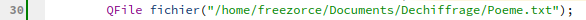
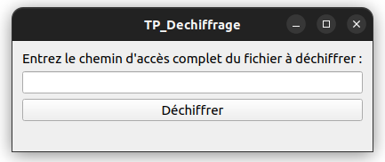
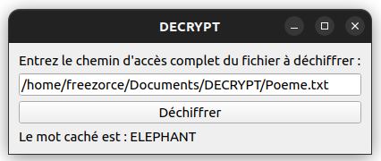

<div id="top"></div>

# La mélodie du ciel

__Envolé dans le ciel, l'oiseau chante sa mélodie,__  
__Lentement, il bat des ailes et vole vers l'infini,__  
__Emportant avec lui mes soucis et mes peines,__  
__Purifiant mon âme de toutes ses chaînes.__

__Haut dans les nuages, il trouve sa liberté,__  
__Apportant la paix à mon esprit tourmenté,__  
__Naviguant dans l'azur, il est le symbole de l'espoir,__  
__Témoignant de la beauté que recèle le pouvoir.__

__*Chat GPT*__    
__*21 Avril 2023*__


C’est un magnifique poème n’est ce pas ! Et si je vous disais qu’un mot était caché dans ce poème me croirai vous ? Aller, suivez moi attentivement, je vais montrer comment déchiffrer ce poème grâce au super programme « Decrypt »

## Decrypt

Decrypt est un petit programme en C++ qui permet de déchiffrer un fichier texte dans lequel se trouve un mot caché. Le programme est réalisé avec la bibliothèque Qt.

## Installation

Pour installer le programme, vous pouvez cloner le dépôt git :

```
git clone https://github.com/mathieuvallade/Dechiffrage.git
```
ou
```
git clone git@github.com:mathieuvallade/DECRYPT.git
```
## Utilisation

Pour utiliser le programme, il suffit de lancer votre application QT, d'ouvrir le projet "TP_Dechiffrage", d'executer le programme. Une fois cela fais, une fenetre apparait et il vous suffit d'entrer le nom du fichier à déchiffrer ("Poeme.txt" dans notre cas) dans la zone de texte prévue à cet effet. Ensuite, cliquez sur le bouton "Déchiffrer" pour afficher le mot caché dans le fichier.

Assurez-vous de modifier le chemin de fichier texte à la ligne 30 et verifiez ce fichier se trouve dans le même répertoire que le projet.
  </br>
  
  </br></br>
</div>

## Résultats

Lorsque vous executez le programme, voici la fenetre qui apparait :
<div>
    
  </br></br>
</div>

Il vous suffit de rentrer le nom du fichier texte dans le zone prévue pour et de cliquer sur "Déchiffrer". Ensuite, la fênetre vous renverra le message caché.
<div>
    
  </br></br>
</div>
Un jeu d'enfant vous voyez !

## Auteur

Ce programme a été développé par [Mathieu Vallade](https://github.com/mathieuvallade).

